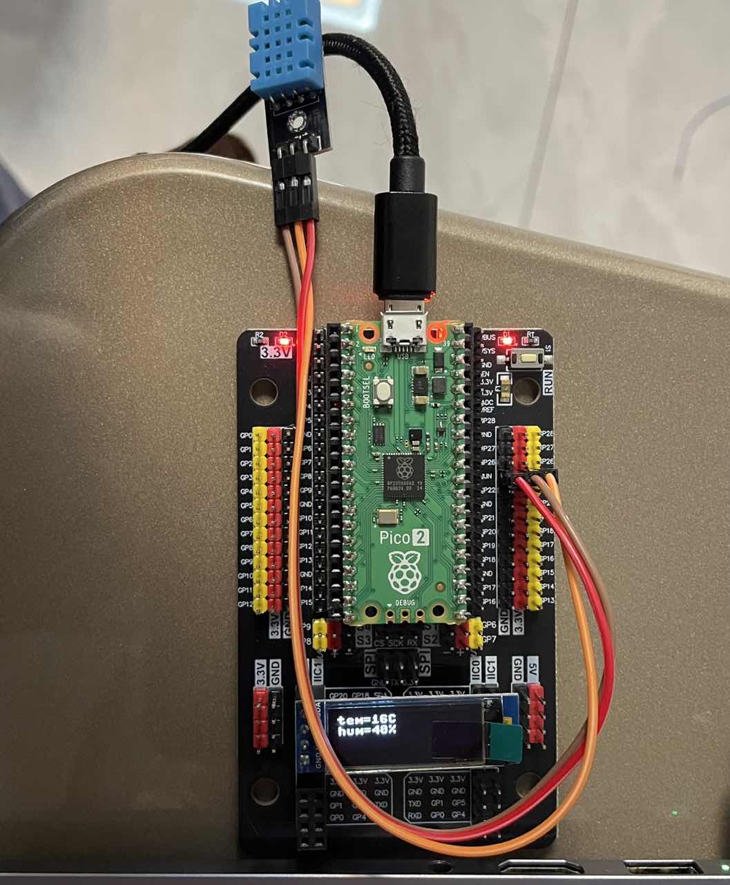
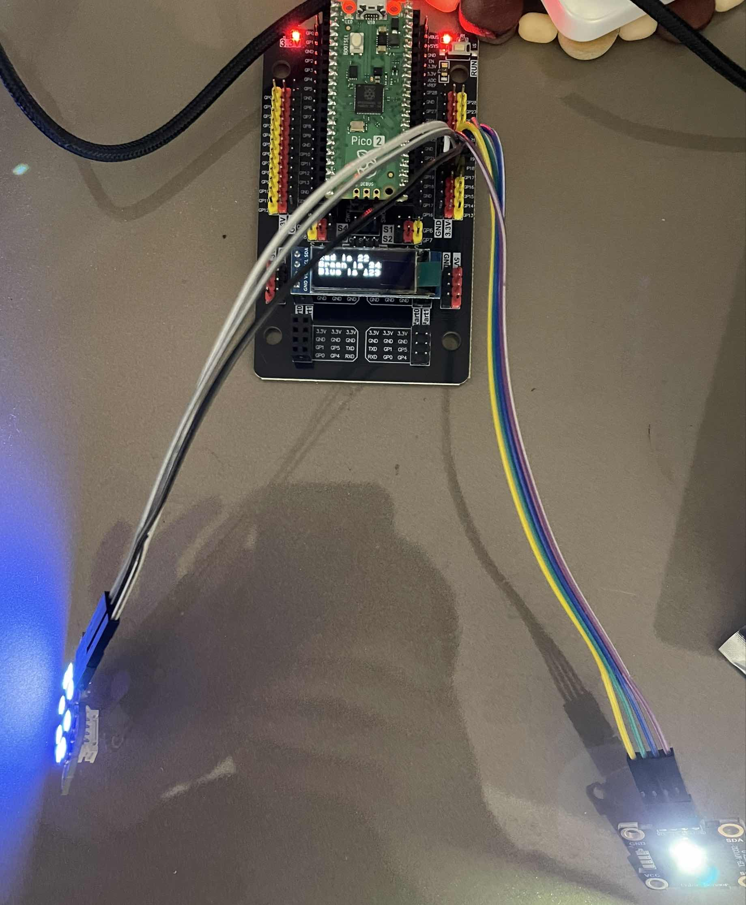

# 传感器代码仓库

## 致谢
传感器项目基于亚博智能的课程，感谢亚博智能提供的课程资源。

## temperature_and_humidity
### 项目内容
基于 Pico2 检测环境温度与湿度，信息显示在 OLED 屏幕上。使用的传感器是 DHT11。

### 项目图片

## color_sensor
### 项目内容
基于 Pico2 检测颜色，颜色信息显示在 OLED 屏幕上，同时将颜色复现到灯环上。有点像《国产凌凌漆》的里达文西发明的电筒。

### 项目图片

